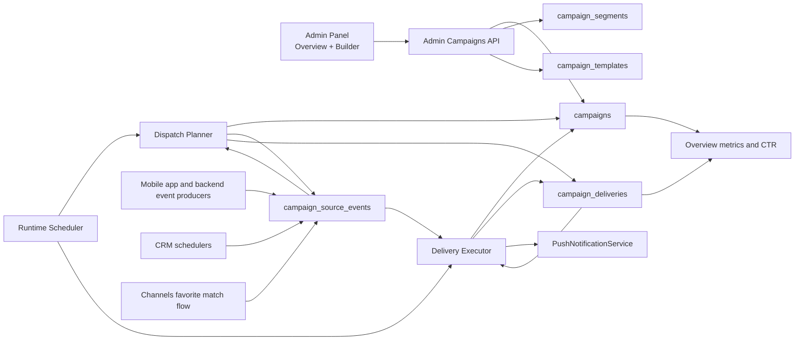

# Campaigns Feature Overview

Last reviewed from code: 2026-04-17

This document describes the implemented Campaigns feature by reading the current admin-panel and backend code. It covers the current shipped behavior, data model, runtime flow, and notable implementation nuances.

## 1. What the feature is

The Campaigns feature is a push-only CRM orchestration system with:

- an admin experience for creating and managing campaigns,
- a backend domain for persisting campaign definitions,
- a planner that materializes campaign journey steps into delivery rows,
- an executor that sends push notifications,
- source-event ingestion for event-based entry and conversion tracking,
- runtime suppression rules that reduce duplicate or invalid sends.

At a high level, the feature lets the team:

- create or edit campaign drafts,
- define audience, trigger type, journey timing, and localized push content,
- reuse shipped or saved scenario templates,
- send traced test pushes,
- schedule a campaign for live runtime execution,
- archive a campaign to stop further planning and sending.

## 2. Current scope and important realities

The current implementation is narrower than the raw type contracts may suggest.

- Channel support is currently `push` only.
- The editor exposes only three deeplink targets for new non-null step actions:
  - `continue_onboarding`
  - `open_match_center`
  - `open_rewards_wallet`
- These three deeplinks are special because they map to backend-supported tracked goals.
- The broader deeplink enum still exists in shared contracts.
- If an older draft contains a legacy unsupported non-null deeplink, the editor renders it as a legacy unsupported value so the admin can replace or clear it.
- Unsupported or mixed non-null deeplink goals are now blocked in the editor before save, and the backend still re-validates the same rule during draft save.
- The builder exposes templates, but it does not currently expose a saved-segment picker or a save-segment action even though the backend and frontend repository already support them.
- `paused` exists as a campaign status in the contract and overview UI filters, but there is no pause/resume action in the current editor flow.

## 3. High-level architecture

## 4. Core concept model

There are two different "goal" concepts in this feature:

### 4.1 Human goal text

This is the free-text goal entered by an admin in the builder, for example:

- "Recover onboarding completion"
- "Drive match center opens"

It is stored as `campaign.goalText` and is primarily a product-facing description.

### 4.2 Backend goal definition

This is the machine-readable success rule derived by the backend from the campaign deeplink target(s). It is stored as `campaign.goalDefinition`.

This backend goal definition is what actually powers:

- goal suppression,
- stop-on-goal behavior for later journey steps,
- success attribution logic.

In the current implementation, a non-null `goalDefinition` can only be created from these deeplink targets:

- `continue_onboarding` -> goal event `onboarding_completed`
- `open_match_center` -> goal event `match_center_opened`
- `open_rewards_wallet` -> goal event `rewards_wallet_opened`

## 5. Admin-panel experience

### 5.1 Routes

The admin-panel exposes three campaign routes:

- `/dashboard/campaigns`
- `/dashboard/campaigns/new`
- `/dashboard/campaigns/[campaignId]`

All three are wrapped in `ProtectedRoute`.

### 5.2 Overview screen

The overview page loads `/campaigns/admin/overview` and shows:

- KPI cards,
- a searchable/filterable campaign list,
- pagination,
- a "New Campaign" entry point.

#### KPI cards

The KPI cards show:

- active campaigns,
- paused campaigns,
- scheduled campaigns,
- pushes sent today,
- delivered rate,
- average CTR,
- CTR delta vs previous 7 days,
- reach currently in progress.

These KPIs come from backend aggregates and are not filtered by the current left-rail filters.

#### Filters

The overview supports:

- search by campaign name, goal text, or owner label,
- status filters,
- trigger-type filters,
- quick views:
  - `active_now`
  - `needs_attention`
  - `recent_drafts`

Important nuance:

- `active_now` and `recent_drafts` are applied at the database query layer.
- `needs_attention` is filtered before pagination is applied.
- `total` and `totalPages` now reflect the full filtered universe, not only the currently loaded page.

#### List row behavior

Each list row shows:

- campaign name and goal text,
- status,
- trigger type,
- audience summary,
- timing summary,
- progress summary,
- outcome summary,
- locale readiness chips,
- creator/owner label.

Important nuances:

- The audience label uses only the first selected retention stage, not the full audience definition.
- The audience estimate is a stored snapshot from the last draft save/update, not a live recalculated audience size.
- The outcome cell shows CTR once the campaign has sent pushes; otherwise it falls back to displaying the free-text goal.

### 5.3 Editor state model

The editor uses a shared reducer-based local state with:

- one canonical `CampaignDraft`,
- one catalog payload,
- one audience estimate payload,
- active builder step,
- active content step,
- dialog state,
- dirty-state tracking,
- last action result,
- last persisted draft snapshot.

The create and edit pages use the same editor component.

### 5.4 Editor step flow

The builder is organized into four steps:

1. Audience
2. Trigger + Journey
3. Step Content
4. Review

The draft is not auto-saved continuously. Save is explicit, but some actions persist automatically:

- `Send Test` saves first if needed
- `Schedule Campaign` saves first if needed

### 5.5 Audience step

The Audience step currently exposes:

- campaign name,
- campaign goal text,
- optional specific-user filter,
- retention stages,
- locales,
- one optional suppression toggle:
  - `excludeUsersWithoutPushOpens`

Specific users are loaded from the users admin API and selected by:

- user id,
- name,
- email lookup in the picker UI.

The UI explicitly communicates that goal suppression is always on. There is no user-facing toggle for enabling or disabling goal suppression.

Important nuances:

- The draft contract supports `segmentSource` and `sourceSegmentId`, but the editor does not currently let the admin choose a saved segment directly.
- In current runtime logic, `segmentSource` and `sourceSegmentId` are metadata/provenance fields. Actual audience resolution uses `criteria` and `suppression`, not segment linkage.

### 5.6 Scenario templates

The left rail in the editor shows scenario templates.

Templates can come from two sources:

- shipped templates baked into backend constants,
- saved templates persisted in the database.

Applying a template replaces most of the draft definition:

- name,
- goal text,
- channel,
- audience,
- trigger,
- journey,
- content.

Saved templates can be deleted from the UI. Shipped templates cannot.

Important nuance:

- When a template is applied, the frontend marks the audience as `template_segment` with `sourceSegmentId = template.id`.
- This metadata is later used to block "save as template" for template-derived campaigns.

### 5.7 Trigger step

The editor supports three trigger families:

- `state_based`
- `event_based`
- `scheduled_recurring`

#### State based

The admin can configure:

- re-entry cooldown in hours

The UI explains that users enter when they match the selected audience and that planner cycles keep checking eligibility.

#### Event based

The admin can configure:

- entry event from a backend-owned catalog,
- re-entry cooldown in hours

The source event catalog shown to new campaigns is restricted. Some supported backend event pairs are intentionally hidden from new selection.

Important nuance:

- Legacy campaigns using hidden but still-supported event pairs can still load in the editor.
- The editor shows a warning when such a campaign is being edited.

#### Scheduled recurring

The editor supports a restricted RRULE builder:

- frequency: daily or weekly
- interval
- weekdays for weekly rules
- time

The UI describes this as user-local scheduling.

Important backend nuance:

- The backend RRULE parser and occurrence generator treat `BYHOUR` and `BYMINUTE` as UTC anchor values.
- Per-user timezone handling then happens later in the step-level send-window logic.
- So the UI wording says "user local," but the actual backend implementation is closer to "global UTC recurrence anchor plus per-user local window fitting."

### 5.8 Journey builder

The journey builder supports multiple steps.

Each step stores:

- `stepKey`
- `order`
- `anchor`
- `delayMinutes`
- `sameLocalTimeNextDay`
- `sendWindowStart`
- `sendWindowEnd`
- `exitRule`
- `frequencyCapHours`

In practice, some of these are fixed by the current system:

- step 1 must anchor to `trigger`
- later steps must anchor to `previous_step`
- backend forces `exitRule = stop_on_goal` for every step

The admin can configure:

- delay minutes,
- next-day same-local-time behavior,
- local send window,
- per-step frequency cap.

Important nuance:

- The editor UI says "minimum gap after any campaign send," and the actual frequency-cap check matches that: it looks at previous live sent deliveries across **all** campaigns for the recipient, not only the current one.

### 5.9 Step content

For each step and locale, the admin can configure:

- push title,
- push body,
- fallback first name,
- optional deeplink target,
- token insertion into title/body.

Supported tokens are:

- `{{first_name}}`
- `{{favorite_team}}`
- `{{bonus_points}}`

The live catalog currently exposes only these deeplink actions:

- Continue onboarding
- Open match center
- Open rewards wallet

Important nuances:

- Although content is edited per step and per locale, non-null deeplinks are validated as one campaign-wide goal contract.
- Every non-null deeplink across all steps and locales must map to the same single supported goal definition.
- The editor only allows new non-null selections from the supported set:
  - Continue onboarding
  - Open match center
  - Open rewards wallet
- If a loaded draft still contains a legacy unsupported non-null deeplink, the editor shows it as legacy unsupported and requires the admin to clear or replace it before saving.
- Mixed deeplink goals across steps or locales are now blocked in editor validation and are also rejected by the backend if they somehow reach draft save.
- Unsupported non-null deeplinks are now blocked in editor validation and are also rejected by the backend at draft save time.

### 5.10 Review, readiness, and UI gates

The editor derives:

- step-level locale readiness,
- aggregate campaign locale readiness,
- warnings,
- validation errors,
- review models for the summary screen.

Readiness rules in the frontend:

- `missing`: title and body are both empty
- `warning`: partial content or `{{first_name}}` without fallback
- `ready`: title/body present and required fallback resolved

Frontend action gates:

- Continue to later builder steps only when the current stage is sufficiently configured.
- Send Test is enabled when the first step exists and at least one locale of that step is `ready`.
- Schedule Campaign is enabled only when:
  - campaign is not archived,
  - campaign is not already scheduled,
  - validation has no errors,
  - every selected audience locale is not `missing`
- Archive Campaign is enabled when the campaign exists and is not archived.

Important nuances:

- The right-rail readiness chips are shown for all `en/es/pt` locales, even if the audience targets only a subset.
- Scheduling in the UI now mirrors the backend schedule gate.
  - warning-level locales are allowed,
  - selected locales with `missing` content still block scheduling,
  - invalid recurring rules still block scheduling.
- Deeplink targets now describe post-tap navigation only.
- Campaign success tracking is configured explicitly through the tracked-goal field, not inferred from step deeplinks.
- Saving as template is more permissive than scheduling:
  - template save ignores "step locale missing content" as a blocking UI error,
  - template-derived campaigns cannot be saved as a new template.

### 5.11 Test-send behavior from the editor

The test-send dialog accepts comma-separated recipient handles.

Handles can be:

- user IDs,
- emails,
- analytics device keys.

Important nuances:

- Test send uses only the first journey step.
- The backend can fall back to the authenticated admin user if no provided handle resolves.
- The response may include warnings.

## 6. Backend admin API

The backend exposes the admin contract under `campaigns/admin`.

Admin access is currently guarded by:

- authenticated user presence,
- email allowlist from `admin.emails` config.

### Endpoints

| Method | Path | Purpose |
| --- | --- | --- |
| `GET` | `/campaigns/admin/overview` | Load overview stats and campaign list |
| `GET` | `/campaigns/admin/catalog` | Load editor catalog |
| `GET` | `/campaigns/admin/:id` | Load one persisted campaign draft |
| `POST` | `/campaigns/admin` | Create campaign draft |
| `PUT` | `/campaigns/admin/:id` | Update campaign draft |
| `POST` | `/campaigns/admin/estimate-audience` | Estimate audience |
| `POST` | `/campaigns/admin/segments` | Save reusable audience segment |
| `POST` | `/campaigns/admin/templates` | Save reusable campaign template |
| `DELETE` | `/campaigns/admin/templates/:id` | Delete saved template |
| `POST` | `/campaigns/admin/:id/send-test` | Insert and execute traced test deliveries |
| `POST` | `/campaigns/admin/:id/schedule` | Schedule or activate live runtime |
| `POST` | `/campaigns/admin/:id/archive` | Archive a campaign |

## 7. Persistence model

### 7.1 `campaigns`

The main campaign row stores:

- mutable definition fields:
  - name
  - goal text
  - goal definition
  - audience
  - trigger
  - journey
  - content
- runtime snapshot fields:
  - status
  - definition version
  - latest audience estimate
  - next dispatch at
  - last dispatch at
  - last sent count
  - last total count
  - created-by metadata
  - archived at

Important nuances:

- `definitionVersion` increments on every draft update.
- Queued deliveries keep the campaign version they were planned against.
- The executor skips deliveries from older versions as `superseded`.

### 7.2 `campaign_deliveries`

This table stores both live and test delivery rows.

It includes:

- kind (`live` or `test`)
- recipient
- locale
- deeplink target
- timezone
- journey instance metadata
- source event linkage
- planned send time
- claim state
- execution status
- rendered push copy
- open timestamp

Important uniqueness and ordering guarantees:

- `delivery_trace_id` is unique.
- `(campaignId, kind, recipientUserId, stepKey, sourceWindowKey)` is unique.
- later steps are claimed only when no earlier step in the same journey instance is still `pending` or `sending`.

Important nuance:

- Terminal earlier steps do not automatically cancel downstream steps.
- If step 1 is `sent`, `failed`, or `skipped`, later steps can still become claimable.
- Goal suppression, not step failure, is what stops later steps automatically.

### 7.3 `campaign_source_events`

This table stores ingress-safe source events used by event-based campaigns and goal attribution.

It stores:

- event key
- producer key
- user id
- event time
- dedupe key
- delivery trace id
- arbitrary properties

Important uniqueness guarantee:

- `(eventKey, producerKey, dedupeKey)` is unique when `dedupeKey` is non-null.

### 7.4 `campaign_segments`

Stores reusable saved audience definitions.

The table exists and the backend supports saving/listing segments, but the live editor currently does not expose a segment picker or "save segment" action.

### 7.5 `campaign_templates`

Stores reusable saved scenario templates.

Saved templates are merged into the editor catalog and shown before shipped templates.

## 8. Draft normalization and validation in the backend

Before a draft is saved, the admin service normalizes and validates:

- audience,
- trigger,
- journey,
- content.

### 8.1 Canonical rules enforced by the backend

The backend rejects drafts when:

- journey has no steps,
- step keys are duplicated,
- step order is not sequential,
- step anchors do not follow the required pattern,
- event-based trigger uses an unsupported shipped event pair,
- recurring trigger has no RRULE,
- recurring trigger uses an invalid RRULE,
- content keys do not match journey step keys exactly,
- an event-based trigger uses the same event as the derived campaign goal,
- non-null deeplink targets do not map to the supported goal set,
- different locales/steps imply different goal definitions.

### 8.2 Fixed trigger and journey contract values

Some contract fields are currently stored but not meaningfully branched on by runtime logic:

- `qualificationMode` is always `when_user_matches_audience`
- `entryMode` is always `first_eligible_event`
- `timezoneMode` is always `user_local`
- `exitRule` is forced to `stop_on_goal`

These fields exist for contract shape and future extensibility more than for current branch behavior.

## 9. Audience resolution

The audience resolver is the backend source of truth for who can enter a campaign.

### 9.1 What actually determines eligibility

Actual eligibility is based on:

- retention stages,
- optional explicit user IDs,
- locale groups,
- non-empty FCM token,
- suppression rules.

`segmentSource` and `sourceSegmentId` do not currently change runtime eligibility by themselves.

### 9.2 Locale grouping

Locale normalization is currently:

- `es*` -> `es`
- `pt*` -> `pt`
- empty or any other language -> `en`

Important nuance:

- English is effectively the default bucket for blank or non-ES/PT user language values.

### 9.3 Audience estimate

Audience estimate:

- uses the same base audience query,
- includes locale and retention-stage breakdowns,
- includes a warning that final reach can be lower.

Important nuance:

- The estimate does not simulate all send-time suppressions.
- In particular, goal suppression and some delivery-time checks are not included in the estimated count.

### 9.4 Suppression rules

The current system uses several suppression layers.

#### Explicit suppression: exclude users who never open campaign pushes

If enabled, the resolver requires at least one prior live campaign delivery with `opened_at IS NOT NULL`.

Important nuance:

- When resolving the current campaign audience, the query excludes the current campaign itself from that historical-open check.

#### Re-entry suppression

For state-based and event-based campaigns, if `reentryCooldownHours > 0`, users who recently received a sent live delivery from the same campaign are suppressed.

Recurring campaigns do not use this branch.

#### Frequency cap

Per-step `frequencyCapHours` suppresses users who received a sent live delivery from **any** campaign inside the recent cap window. The check is global across all campaigns, matching what the editor UI describes as a "minimum gap after any campaign send."

Note: re-entry suppression (`reentryCooldownHours`) is separate and still scoped to the same campaign only.

#### Goal suppression

Goal suppression is mandatory and not user-configurable.

It runs:

- during planning,
- again right before send.

The exact logic depends on the goal attribution mode:

- `global_state_event`
  - used for onboarding completion
  - any matching goal event for that user after `journeyStartedAt` suppresses later sends
- `trace_required_response`
  - used for match center and rewards wallet goals
  - only goal events that can be joined back to a prior campaign delivery trace count

## 10. Planning logic

The planner converts campaign definitions into pending delivery rows.

### 10.1 Common behavior

For all trigger types, the planner:

- determines a journey instance key,
- determines a journey start time,
- resolves eligible users,
- materializes only the first journey step,
- stores one pending delivery row for the current executable step.

Every materialized row stores:

- locale,
- recipient timezone,
- journey instance metadata,
- source window key,
- step order,
- planned send time.

### 10.2 State-based campaigns

State-based campaigns are evaluated on planner cadence buckets.

The journey instance key is:

- `state:<campaignId>:<bucketStartUtc>`

The bucket start is rounded down to the configured planner cadence.

Default planner cadence fallback in code:

- 15 minutes

After planning, the campaign remains active and `nextDispatchAt` is advanced by the cadence interval.

### 10.3 Event-based campaigns

Event-based campaigns plan from `campaign_source_events`.

For each due planning pass, the planner:

- loads unplanned source events for the campaign's event/producers pair,
- ignores events without `userId`,
- checks if the event's user still matches the campaign audience and suppressions,
- creates a journey instance key:
  - `event:<sourceEventId>`
- materializes only the first journey step from the source event time.

Important nuance:

- A source event is considered planned once any live delivery row references its `sourceEventId`.
- The same source event is not replanned for the same campaign even if later sends fail or are skipped.

### 10.4 Scheduled recurring campaigns

Recurring campaigns evaluate the campaign RRULE against each recipient's local wall-clock time inside the current planner window.

The journey instance key is:

- `rrule:<occurrenceISOString>`

After planning, the campaign is marked active and `nextDispatchAt` moves to the next backend evaluation tick.

Important nuance:

- recurring runtime keeps a schedule-time anchor so `INTERVAL` is evaluated consistently,
- planner windows are cadence-based, but the actual occurrence moment is still per-user local time,
- overview timing for recurring campaigns now represents evaluation timing, not a guaranteed global send instant.

### 10.5 Per-user delivery materialization

When rows are materialized:

- locale is chosen from `user.language`,
- recipient timezone is normalized from the user timezone,
- each step is anchored to the previous computed step send time,
- the source window key is:
  - `<journeyInstanceKey>:<stepKey>`

Important nuance:

- Only the first step is planned up front.
- Later steps are materialized by the executor after the current row reaches a terminal state that still allows journey continuation.
- Sequencing is still enforced at claim time.

## 11. Journey timing policy

The journey timing service owns:

- delay application,
- same-local-time-next-day behavior,
- local send windows,
- DST-safe time calculations,
- replan behavior when the executor reaches a row outside its valid local window.

### 11.1 Window behavior

If a candidate local time is:

- before `sendWindowStart`, it is clamped to window start,
- after `sendWindowEnd`, it moves to the next local day at window start,
- inside an overnight wrapped window, it stays unchanged.

### 11.2 DST behavior

The implementation explicitly handles DST edge cases:

- spring-forward gaps move to the next valid local minute on that day,
- fall-back ambiguous local minutes choose the earliest valid UTC instant.

### 11.3 Replanning after a missed window

If the executor claims a row and finds that `now` is outside the allowed local window:

- the current row is requeued with a new `plannedSendAt`,
- downstream pending steps in the same journey instance are shifted accordingly,
- no skip rules or push send happen for that execution attempt.

## 12. Delivery execution logic

The executor runs against claimed due delivery rows.

### 12.1 Claim behavior

Rows are claimable only when:

- status is `pending`,
- `plannedSendAt <= now`,
- journey instance metadata is present,
- there is no earlier step in the same journey instance still `pending` or `sending`.

This uses SQL `FOR UPDATE SKIP LOCKED`.

### 12.2 Stale lease recovery

Rows stuck in `sending` beyond the sending lease are moved back to `pending`.

Default sending lease fallback in code:

- 10 minutes

### 12.3 Execution-time skip and failure checks

Before a push is sent, the executor can mark the row as terminal for several reasons:

- `campaign_missing`
- `campaign_archived`
- `superseded`
- `recipient_missing`
- `runtime_metadata_missing`
- `audience_no_longer_matches`
- `frequency_cap`
- `goal_already_reached`

Important nuance:

- Send-time audience revalidation intentionally disables goal, re-entry, and frequency-cap logic during the generic "still matches audience" check.
- Those suppressions are evaluated separately afterward.

### 12.4 Rendering and push payload

When a row passes all checks:

- step content is loaded for the row locale,
- tokens are rendered from preloaded user context,
- deeplink metadata is added,
- the push is sent through `PushNotificationService.sendNotificationToUser`.

The campaign push payload includes:

- `campaignId`
- `deliveryTraceId`
- optional `deeplinkTarget`
- optional `path`

Important nuances:

- `opened_at` is not set by the send itself.
- `opened_at` is populated later when a traced `app-opened` event arrives.

### 12.5 Token resolution

The token resolver can currently inject:

- first name
- favorite team
- total bonus points

Token context is loaded from:

- `users`
- `user_favorites` joined to `teams_leagues`
- latest `analytics_devices` locale

Fallback behavior:

- `{{first_name}}` falls back to the localized fallback name or `"there"`
- `{{favorite_team}}` falls back to `"your team"`
- `{{bonus_points}}` falls back to `"0"`

## 13. Runtime scheduler

The runtime scheduler runs every minute.

Per tick it does:

1. recover stale sending deliveries
2. if the current UTC minute matches planner cadence, run planner
3. run executor

Important nuance:

- Planner cadence is minute-gated inside the every-minute cron.
- Delivery execution still runs every minute even when planner work is skipped.

## 14. Source-event ingestion and attribution

The campaign runtime depends on several source-event producers.

### 14.1 Mobile-authenticated app-opened

Endpoint:

- `POST /crm-source-events/app-opened`

Behavior:

- records `app_opened`
- if `delivery_trace_id` is present, marks the matching delivery row as opened

This is what powers campaign open tracking and CTR.

### 14.2 Public onboarding-completed

Endpoint:

- `POST /crm-source-events/onboarding-completed`

Behavior:

- requires public CRM source-events key
- records `onboarding_completed`
- dedupe key is normally device-based
- if a delivery trace is present, dedupe becomes `device + trace`

Important nuance:

- This prevents traced conversions from being swallowed by generic device-level onboarding dedupe.

### 14.3 Authenticated match-center-opened

Endpoint:

- `POST /crm-source-events/match-center-opened`

Behavior:

- requires `delivery_trace_id`
- records `match_center_opened`
- dedupe is trace-bound

This is a trace-required campaign goal response.

### 14.4 Authenticated rewards-wallet-opened

Endpoint:

- `POST /crm-source-events/rewards-wallet-opened`

Behavior:

- requires `delivery_trace_id`
- records `rewards_wallet_opened`
- dedupe is trace-bound

This is also a trace-required campaign goal response.

### 14.5 CRM scheduler and backend producers

The CRM layer forwards selected event types into `campaign_source_events`, including:

- subscription started
- subscription renewed
- in-app purchase completed
- daily streak reminder
- weekly quest urgency
- weekly stats digest
- unread social activity
- live challenge starting soon
- live challenge results
- lifecycle stage events

The lifecycle scheduler emits:

- `stage_at_risk_wau`
- `stage_at_risk_mau`
- `stage_dead_user`
- `stage_reactivated`
- `stage_resurrected`

The channels service emits:

- `favorite_match_kickoff`

Important nuance:

- Some lifecycle source events are supported by the backend but intentionally hidden from the new-campaign editor catalog.

## 15. Status lifecycle

### 15.1 Draft creation

Creating a campaign draft:

- validates canonical structure,
- estimates audience,
- derives goal definition,
- stores draft with `status = draft`.

### 15.2 Update

Updating a draft:

- locks the campaign row,
- re-validates the full definition,
- refreshes audience estimate,
- re-derives goal definition,
- increments `definitionVersion`.

### 15.3 Schedule

Scheduling behavior depends on trigger type.

For state-based and event-based campaigns:

- `getNextPlanningAt` returns `now`
- scheduling immediately activates the campaign
- planner and executor may run immediately

For recurring campaigns:

- scheduling may set status to `scheduled` until the first RRULE occurrence
- if the occurrence is already due, the campaign becomes active immediately

Important nuance:

- "Schedule Campaign" often means "activate the runtime now," not necessarily "queue the first push for some later date."

### 15.4 Archive

Archiving:

- sets `status = archived`
- sets `archivedAt`
- clears `nextDispatchAt`

Important nuance:

- This stops new planning.
- Already queued rows can still be claimed later, but the executor will mark them `skipped` because the campaign is archived.

### 15.5 Paused

`paused` exists in the shared model and overview filters, but no current admin flow sets a campaign to paused or resumes it.

## 16. Shipped catalog content

### 16.1 Shipped saved-segment seeds

The backend currently ships these segment seeds:

| Seed | Meaning |
| --- | --- |
| `seg_new_users_setup_dropoff` | New users who did not finish onboarding |
| `seg_at_risk_wau` | Inactive today, active 1-6 days ago |
| `seg_at_risk_mau` | Inactive this week, active 7-29 days ago |
| `seg_dead_user` | Inactive for 30+ days |
| `seg_reactivated` | First day back after 7-29 inactive days |
| `seg_resurrected` | First day back after 30+ inactive days |

### 16.2 Shipped scenario templates

The backend currently ships these scenario templates:

| Template | Trigger | Journey | Goal |
| --- | --- | --- | --- |
| Onboarding recovery | State based | 3 steps | Recover onboarding completion |
| Favorite match kickoff | Event based | 1 step | Drive match center opens |
| Onboarding completed activation | Event based | 1 step | Drive first match center open after setup |
| At-risk WAU retention | Scheduled recurring | 1 step | Bring back at-risk weekly users |
| At-risk MAU retention | Scheduled recurring | 1 step | Bring back at-risk monthly users |
| Dead user winback | Scheduled recurring | 1 step | Bring back users inactive for 30+ days |

## 17. Notable implementation nuances and caveats

These points are especially important when reasoning about current behavior.

### 17.1 Goal tracking is deeplink-driven, not text-driven

The free-text goal field is descriptive only. Actual tracked success behavior comes from backend-derived `goalDefinition`.

### 17.2 A campaign can currently have only one backend-tracked goal

If different steps/locales imply different supported goals, the editor now blocks the draft locally and the backend still rejects it on draft save.

### 17.3 The editor contract is wider than the live feature surface

The type system includes more deeplinks and segment flows than the current live catalog/UI actually uses.

### 17.4 Saved segments are supported in the backend but not surfaced in the editor

The backend can save and list segments, but the current live editor does not let admins choose or save them from the UI.

### 17.5 Template provenance is metadata, not runtime logic

`template_segment` and `sourceSegmentId` currently matter for UI/management behavior, especially "cannot re-save as template," but not for actual audience resolution.

### 17.6 UI and backend schedule gates are aligned

Both surfaces now allow warning states, while still rejecting missing selected-locale content and invalid recurring rules.

### 17.7 Recurring runtime now matches the user-local wording

The UI speaks in user-local schedule terms, and the backend now evaluates recurring eligibility per user local time before materializing the first journey step.

### 17.8 `needs_attention` quick view is a truthful pre-pagination filter

It is filtered before pagination, so totals and page counts stay accurate.

### 17.9 Later steps are created step-by-step after terminalization

Later steps are no longer pre-materialized. They are inserted after a step finishes unless the campaign became invalid, the row was requeued, or the journey goal was already reached.

### 17.10 Test sends are single-step only

The test flow only inserts and executes the first journey step, not the full journey.

### 17.11 Campaign open tracking is trace-based app-open tracking

CTR depends on traced `app_opened` events that mark `opened_at`, not on a generic push-provider "delivered/opened" callback.

### 17.12 Definition versioning protects runtime from stale queued rows

Updating a live draft does not rewrite already planned rows. Instead, executor-side version checks skip older queued deliveries as `superseded`.

## 18. Practical end-to-end flow

A typical live flow looks like this:

1. Admin creates a draft in the builder.
2. Backend validates the canonical structure and stores the draft.
3. Admin optionally saves a template or sends a test.
4. Admin schedules the campaign.
5. Backend sets the campaign to active or scheduled, depending on trigger timing.
6. Runtime planner creates pending delivery rows for eligible users or source events.
7. Runtime executor claims rows, rechecks eligibility/suppressions, renders tokens, and sends pushes.
8. The push includes `deliveryTraceId` and optional navigation metadata.
9. The app or backend producers emit source events back into `campaign_source_events`.
10. Traced app opens increase CTR/open metrics.
11. Traced or global goal events suppress later steps in the same journey instance.
12. Overview metrics and progress update from `campaign_deliveries`.

## 19. Summary

The Campaigns feature is implemented as a full campaign orchestration pipeline, not just an admin form:

- the admin-panel owns campaign definition and operator workflow,
- the backend owns canonical validation and persistence,
- the planner owns entry into journey instances,
- the executor owns safe send-time enforcement,
- source-event ingestion closes the loop for event triggers, opens, and goal attribution.

The most important current design decision is that campaign success logic is backend-owned and derived from supported deeplink targets, with mandatory suppression applied both during planning and again before send.
