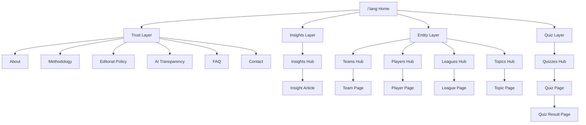
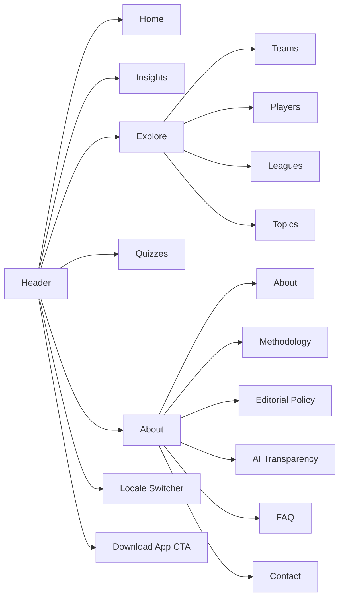
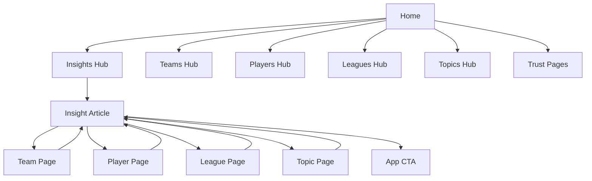

# Website Information Architecture And SEO Structure

## Назначение документа

Этот документ собирает в одну систему выводы из:

- `docs/refactor-plan.pdf`
- `docs/ADMIN_PANEL_ARCHITECTURE_CORE.md`

Цель: зафиксировать целевую структуру публичного сайта SirBro так, чтобы она:

- опиралась на уже сделанную архитектурную базу;
- была удобной для пользователя;
- была понятной для crawl/index;
- поддерживала рост через `trust pages`, `insights`, `entities`, `quizzes`;
- не создавала хаотичный набор страниц и thin-content маршрутов.

Для `Этапа 1.5` этот документ считается primary source of truth по structure, navigation, indexation и internal linking public site.

## Current Status

По состоянию на `2026-03-27` homepage уже:

- реализована;
- синхронизирована с текущим Pencil-макетом `Q0YlO`;
- задеплоена.

Этот IA-документ больше не трактуется как homepage redesign brief.
Он остается актуальным как структура для следующего расширения public SEO surface:
trust pages, insights, entities, topics и quizzes поверх уже shipped homepage.

## Базовые ограничения и опоры из того, что уже сделано

Ниже решения, от которых стоит отталкиваться, а не ломать их без сильной причины:

- публичный контур уже стандартизован вокруг `/:lang/*`;
- `/` уже задуман как redirect на дефолтную локаль;
- локали: `en`, `pt`, `es`;
- route groups уже разведены на `public`, `auth`, `admin`, `deeplink`;
- SEO infrastructure core уже готова: metadata builders, schema builders, sitemap, robots, route registry;
- content layer уже готов к расширению под `trust pages`, `insights`, `entities`, `quizzes`;
- deep-link, auth и admin уже изолированы от public SEO contour.

Вывод для IA: на следующем этапе лучше развивать именно локализованную структуру `/:lang/...`, а не возвращаться к смешанной схеме вида `en` в корне, а остальные локали в поддиректориях.

## Главный принцип структуры

Сайт должен состоять не из одной лендинговой страницы, а из четырех SEO-слоев:

1. `Home / Hub Layer`
   Главная страница локали как обзорный хаб и точка входа.

2. `Trust Layer`
   Страницы, которые объясняют кто такие SirBro, как работает анализ, почему контенту можно доверять.

3. `Content Layer`
   `Insights` и evergreen-материалы, которые отвечают на конкретные поисковые интенты.

4. `Entity Layer`
   Страницы команд, игроков, лиг и тем, которые связывают новостной и evergreen-контент в кластеры.

`Quiz Layer` добавляется как growth/social слой, но не должен становиться ядром SEO-архитектуры.

## Целевая карта сайта

### Каноническая структура URL

Все публичные страницы живут под локалью.

```text
/:lang
/:lang/about
/:lang/methodology
/:lang/editorial-policy
/:lang/ai-transparency
/:lang/faq
/:lang/contact
/:lang/privacy
/:lang/terms
/:lang/disclaimer
/:lang/cookies

/:lang/insights
/:lang/insights/[insight-slug]

/:lang/teams
/:lang/teams/[team-slug]

/:lang/players
/:lang/players/[player-slug]

/:lang/leagues
/:lang/leagues/[league-slug]

/:lang/topics
/:lang/topics/[topic-slug]

/:lang/quizzes
/:lang/quizzes/[quiz-slug]
/:lang/quizzes/[quiz-slug]/result/[result-slug]
```

### Что не должно индексироваться как самостоятельный SEO-слой

- внутренние filter URLs;
- search results pages;
- пагинация без достаточной ценности;
- пустые category/tag pages;
- quiz result pages без уникальной ценности;
- технические служебные URL;
- auth/admin/deeplink routes.

## Рекомендуемая структура верхнего меню

### Desktop Header

```text
Logo
Home
Insights
Explore
Quizzes
About
Locale Switcher
Download App CTA
```

### Наполнение пунктов меню

#### `Insights`

- All Insights
- Latest Insights
- Injury Impact
- Match Outlook
- Lineup Changes
- Tactical Analysis

Примечание: если topic hubs еще не реализованы, первые недели пункт может вести только на `/:lang/insights` с внутренними секциями.

#### `Explore`

- Teams
- Players
- Leagues
- Topics

Это главный навигационный мост к evergreen entity layer.

#### `Quizzes`

- All Quizzes
- Trending Quizzes
- New Quizzes

#### `About`

- About SirBro
- Methodology
- Editorial Policy
- AI Transparency
- FAQ
- Contact

### Mobile Navigation

Мобильное меню должно повторять ту же логику, но в следующем порядке:

1. Home
2. Insights
3. Teams
4. Players
5. Leagues
6. Topics
7. Quizzes
8. About
9. Methodology
10. FAQ
11. Contact
12. Download App CTA

Причина такого порядка: сначала intent-driven discovery, потом trust, потом conversion.

## Структура footer

Footer не должен быть просто юридическим блоком. Он должен усиливать crawl depth и trust.

### Footer Columns

#### `Product`

- Home
- Download App
- Chat Preview
- How It Works

#### `Insights`

- Latest Insights
- Trending Topics
- Teams
- Players
- Leagues

#### `Company`

- About
- Methodology
- Editorial Policy
- AI Transparency
- Contact
- FAQ

#### `Legal`

- Privacy
- Terms
- Disclaimer
- Cookies

#### `Social / Stores`

- App Store
- Google Play
- X / Twitter
- Instagram
- TikTok

## Роли ключевых страниц

### 1. Home `/:lang`

Это не просто лендинг, а SEO hub первого уровня.

#### Обязательные блоки главной

1. Hero с value proposition
2. Store CTA
3. Short product explainer
4. How It Works
5. Trust strip
6. Latest Insights
7. Trending Topics
8. Top Teams / Players / Leagues
9. Featured Quiz
10. FAQ
11. About / Methodology preview
12. Final CTA

#### Что home должна делать для SEO

- объяснять продукт нормальным поисковым языком;
- давать ссылки в глубину сайта;
- закрывать брендовые и частично информационные интенты;
- передавать authority на `insights`, `entities`, `trust pages`.

### 2. Trust Pages

Это слой доверия и объяснения продукта.

#### `/:lang/about`

Роль:

- брендовая история;
- объяснение миссии;
- описание продукта и persona SirBro;
- мост между app value proposition и контентным слоем.

#### `/:lang/methodology`

Роль:

- как формируются insights;
- какие сигналы и data points учитываются;
- где заканчивается факт и начинается аналитическая интерпретация;
- почему контент не является гарантией результата.

#### `/:lang/editorial-policy`

Роль:

- правила подготовки материалов;
- работа с источниками;
- update policy;
- review policy;
- outdated content policy.

#### `/:lang/ai-transparency`

Роль:

- как используется AI;
- где есть human review;
- какие ограничения у модели;
- как снижается риск hallucination и thin content.

#### `/:lang/faq`

Роль:

- быстрые ответы на коммерческие и информационные вопросы;
- дополнительный long-tail слой;
- разметка `FAQPage`.

#### `/:lang/contact`

Роль:

- контактный канал;
- trust signal;
- поддержка business/press/legal inquiries.

### 3. Insights Hub

#### `/:lang/insights`

Это центральный SEO-хаб новостного и аналитического слоя.

#### Структура страницы

1. Hero с пояснением формата insights
2. Latest Insights
3. Featured insight
4. Sections by topic
5. Sections by team / player / league
6. Evergreen explainer links
7. App CTA

#### Внутренние секции хаба

- Latest
- Injury Impact
- Match Outlook
- Lineup Changes
- Tactical Analysis
- Team Form

Если фильтры появятся в UI, их лучше сначала держать как UX-state, а не как индексируемые filter pages.

### 4. Insight Article

#### `/:lang/insights/[insight-slug]`

Роль страницы:

- закрывать конкретный long-tail intent;
- давать факт + собственный анализ;
- перелинковывать на сущности и связанные материалы;
- конвертировать в приложение.

#### Рекомендуемый шаблон

1. H1
2. Metadata row: author, reviewer, published, updated
3. Factual summary
4. External source
5. Why it matters
6. SirBro insight
7. Long-term outlook
8. Related entities
9. Related insights
10. Sticky CTA

### 5. Entity Hubs

Это второй главный SEO-слой после insights.

#### `/:lang/teams`

Роль:

- directory hub по командам;
- переходы на individual team pages;
- вход в клубные кластеры.

#### `/:lang/players`

Роль:

- directory hub по игрокам;
- переходы на player pages;
- сбор evergreen спроса по игрокам.

#### `/:lang/leagues`

Роль:

- directory hub по лигам;
- группировка контента по competition intent.

#### `/:lang/topics`

Роль:

- directory hub по evergreen темам;
- injury, suspensions, lineups, xG, tactical shifts, form, transfers.

### 6. Entity Detail Pages

#### `/:lang/teams/[team-slug]`

Основные блоки:

1. Team overview
2. Current form / season context
3. Latest insights about the team
4. Key players
5. League context
6. Related topics
7. App CTA

#### `/:lang/players/[player-slug]`

Основные блоки:

1. Player overview
2. Role / usage / tactical context
3. Recent insight articles
4. Related team
5. Injury / form / lineup impact links
6. App CTA

#### `/:lang/leagues/[league-slug]`

Основные блоки:

1. League overview
2. Featured teams
3. Featured players
4. Latest league insights
5. Related topics
6. App CTA

#### `/:lang/topics/[topic-slug]`

Основные блоки:

1. Topic definition
2. Why the topic matters
3. Related insights
4. Related teams / players / leagues
5. FAQ on the topic
6. App CTA

### 7. Quiz Layer

#### `/:lang/quizzes`

Роль:

- social/virality hub;
- дополнительный engagement слой;
- secondary internal linking source.

#### `/:lang/quizzes/[quiz-slug]`

Роль:

- canonical quiz landing;
- index only if quiz page itself substantive and shareable.

#### `/:lang/quizzes/[quiz-slug]/result/[result-slug]`

Роль:

- result/share layer;
- по умолчанию `noindex`, пока не доказана реальная SEO-ценность.

## Визуальная схема сайта

### Общая карта уровней



### Навигационная схема header



### SEO-cluster linking



## Иерархия по приоритету индексации

### Tier 1: обязательно index

- `/:lang`
- `/:lang/about`
- `/:lang/methodology`
- `/:lang/editorial-policy`
- `/:lang/ai-transparency`
- `/:lang/faq`
- `/:lang/contact`
- `/:lang/insights`
- `/:lang/insights/[insight-slug]`
- `/:lang/teams`
- `/:lang/teams/[team-slug]`
- `/:lang/players`
- `/:lang/players/[player-slug]`
- `/:lang/leagues`
- `/:lang/leagues/[league-slug]`
- `/:lang/topics`
- `/:lang/topics/[topic-slug]`
- legal pages

### Tier 2: условный index

- `/:lang/quizzes`
- `/:lang/quizzes/[quiz-slug]`

Только если страница имеет нормальный copy layer, уникальные metadata и реальную ценность вне шаринга.

### Tier 3: по умолчанию noindex

- `/:lang/quizzes/[quiz-slug]/result/[result-slug]`
- filter states
- internal search
- pagination pages без уникальной полезности
- draft и weak content

## Breadcrumb модель

### Home

Нет breadcrumb trail.

### Trust Pages

```text
Home > About
Home > Methodology
Home > FAQ
```

### Insight Article

```text
Home > Insights > [Article]
```

Если статья жестко привязана к topic hub, допустим альтернативный trail:

```text
Home > Topics > [Topic] > [Article]
```

Но canonical breadcrumb pattern лучше держать единым через `Insights`.

### Entity Pages

```text
Home > Teams > [Team]
Home > Players > [Player]
Home > Leagues > [League]
Home > Topics > [Topic]
```

### Quizzes

```text
Home > Quizzes > [Quiz]
```

## Матрица внутренней перелинковки

### Home должна ссылаться на

- latest insights;
- featured topics;
- top teams;
- top players;
- top leagues;
- about;
- methodology;
- faq;
- quizzes.

### Insight article должна ссылаться на

- insights hub;
- related insight articles;
- relevant team pages;
- relevant player pages;
- relevant league pages;
- relevant topic pages;
- methodology;
- app CTA.

### Team page должна ссылаться на

- latest team insights;
- key player pages;
- league page;
- related topics;
- quizzes where relevant.

### Player page должна ссылаться на

- latest player insights;
- related team page;
- topic pages like injury, form, lineup;
- methodology if analysis-heavy blocks are present.

### League page должна ссылаться на

- featured team pages;
- featured player pages;
- latest league insights;
- related topics.

### Topic page должна ссылаться на

- insight articles;
- teams;
- players;
- leagues;
- FAQ where appropriate.

## Структура главной страницы как SEO hub

```text
01 Hero
02 App Store / Google Play CTA
03 What SirBro Does
04 How It Works
05 Why Trust SirBro
06 Latest Insights
07 Trending Topics
08 Featured Teams
09 Featured Players
10 Featured Leagues
11 Featured Quiz
12 FAQ
13 About + Methodology preview
14 Final CTA
15 Footer
```

## Структура страницы insights hub

```text
01 Hero
02 Latest Insights
03 Featured Insight
04 Injury Impact
05 Match Outlook
06 Tactical Analysis
07 Lineup Changes
08 Teams / Players / Leagues shortcuts
09 Methodology preview
10 CTA
11 Footer
```

## Структура entity page

Подходит для team/player/league/topic detail pages с адаптацией контента.

```text
01 Hero / overview
02 Why this entity matters
03 Latest related insights
04 Related entities
05 FAQ or quick facts
06 CTA
07 Footer
```

## Что это означает для текущей архитектуры

### Уже готово и может быть использовано сразу

- localized public routing;
- sitemap and robots source of truth;
- metadata/schema builders;
- content repository contract;
- базовые public pages;
- readiness для `trust`, `insights`, `entities`, `quizzes`.

### Что нужно добавить следующим слоем

#### Новые page keys для trust stack

- `editorial-policy`
- `ai-transparency`
- `contact`

#### Новые public route types / repositories

- insights hub and article detail;
- entity hubs and entity details;
- quizzes hub and quiz detail;
- noindex handling for quiz result pages and weak pages.

#### Новые content contracts

- insight content model;
- entity content model;
- quiz content model;
- author / reviewer / source metadata;
- internal linking fields;
- quality gate fields.

## Приоритет внедрения

1. Home как полноценный hub.
2. Trust stack.
3. Insights hub.
4. Insight article template.
5. Entity hubs.
6. Entity detail pages.
7. Quizzes hub.
8. Quiz detail and selective indexing.

## Итоговое решение

Целевая структура сайта должна строиться вокруг одной сильной локализованной home page и трех опорных кластеров:

- `Trust`
- `Insights`
- `Entities`

`Quizzes` остаются заметным, но вторичным слоем.

Такая архитектура лучше всего совпадает сразу с тремя вещами:

- с SEO roadmap, где нужна сильная home page, trust pages, insights и evergreen entities;
- с refactor plan, где приоритет отдан long-tail content, hreflang, article structure и structured data;
- с текущим `admin-panel` core, который уже готов принимать именно такие типы публичных страниц без смешивания с admin и deeplink контуром.

## Immutable Decisions For Stage 1.5

Ниже решения считаются закрытыми для `Этапа 1.5` и не должны переоткрываться на `Этапе 1.6` или `Этапе 2`.

1. Public site живет в localized structure `/:lang/*`, а `/` остается redirect на default locale.
2. Основные public SEO layers фиксируются как `Home`, `Trust`, `Insights`, `Entities`, `Quizzes`.
3. `Trust`, `Insights` и `Entities` считаются core SEO layers; `Quizzes` считаются secondary layer и не определяют архитектуру сайта.
4. `quiz result pages` по умолчанию считаются `noindex`.
5. `filter URLs`, internal search pages и thin pagination pages на старте не считаются indexable SEO surfaces.
6. Обязательный trust stack включает:
   - `About`
   - `Methodology`
   - `Editorial Policy`
   - `AI Transparency`
   - `FAQ`
   - `Contact`
7. Все новые public page types должны подчиняться hub/detail model, metadata/schema layer и indexability rules текущего `admin-panel` core.
8. Technical handoff для следующего implementation layer закреплен в `docs/PUBLIC_CONTENT_TECHNICAL_BACKLOG.md`.
